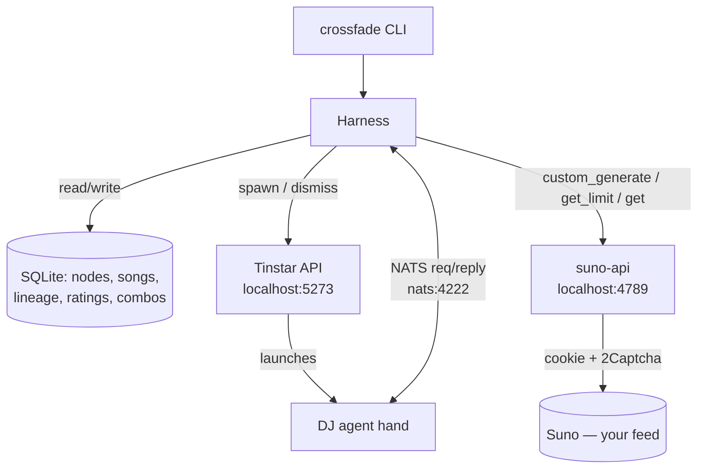

# feat: crossfade — Suno Radio Station Harness + DJ

## Summary

Build crossfade as two cooperating pieces on top of the existing suno-api spike: a deterministic Node **harness** (SQLite inspiration graph, daily credit budget, suno-api generation, ratings, CLI) and a **DJ** — a Tinstar agent summoned on demand over NATS that picks surprising combinations from the graph and writes each song. The first unit unblocks live Suno generation; everything else builds on `generate.mjs`'s proven generate-and-poll flow.

---

## Problem Frame

The spike (`generate.mjs` + `song.json`) proves a single hand-authored brief can become a song in the Suno feed, but it stops there: no inventory to recombine, no memory of what inspired what, no budget guard, and live generation is currently blocked on credentials. crossfade turns that one-shot into a station — a seeded graph of influences, a DJ that combines them, a budget that lets it run unattended-ish, and lineage that records why each song exists.

Two facts from research shape the build. First, suno-api has no credit-cost constant and gates generation behind a 2Captcha-funded hCaptcha solve, so budget is an estimate (~10 credits/generation, 2 clips) and live generation cannot be proven until credentials are funded. Second, the DJ transport is real and local: a NATS broker at `nats://127.0.0.1:4222` the harness can join directly with the `nats` Node client, and a Tinstar dashboard at `http://localhost:5273` that spawns agent "hands" — so the DJ is summoned per use, not a standing service.

---

## Requirements

Traceability is to the origin requirements doc (`see origin`). Origin IDs: R1–R19, actors A1–A4, flows F1–F4, acceptance examples AE1–AE3.

### Graph and data

- R1–R5 — open-ended node types, real-name storage with descriptor translation at generation time, per-song lineage edges, plain SQLite with recursive-CTE graph queries, UI-ready schema. Carried by U3.

### DJ, transport, and curation

- R6–R8 — summon the DJ with inventory + combo history + rated lineage; it returns N briefs in `song.json` shape, avoids repeats, explores under-used nodes. Carried by U7, U8.
- R18–R19 — DJ ↔ harness over NATS; harness is system of record, DJ holds no durable state. Carried by U6 (transport), U7 (summon + statelessness). **Plan divergence from origin:** R18 says "persistent Tinstar agent"; this plan summons the DJ on demand and tears it down after (see KTD-2).

### Generation and budget

- R9, R11 — reuse suno-api `custom_generate` + poll-to-`audio_url`; songs land in the Suno feed. Carried by U4, U8.
- R10 — persist concept, exact inputs, clip ids/urls, and lineage. Carried by U3 (storage), U8 (orchestration).
- R12–R13 — daily credit window tied to the free-tier 50/day; project batch cost and refuse over cap or reserve floor; bursts are user-triggered, never scheduled. Carried by U5, U8. Covers AE1.

### Ratings and interface

- R14–R15 — thumb + optional note, stored by the harness, fed back to the DJ next summon. Carried by U9.
- R16–R17 — directed what-if reuses the burst pipeline minus DJ selection; v1 is harness CLI + DJ conversation, no web UI. Carried by U9.

---

## Key Technical Decisions

- KTD-1. **Reuse the spike's pipeline; add fast-fail.** The suno-api client wraps the exact flow `generate.mjs` already proves — `get_limit` precheck, `custom_generate` with `prompt`/`tags`/`title`, poll `/api/get?ids=` until `audio_url`. The one behavioral addition is treating clip `status === 'error'` as a hard failure (surfacing `error_message`) instead of polling the full timeout, which the spike does not do (see origin: generation pipeline).

- KTD-2. **DJ is summoned on demand, not persistent.** The harness spawns a DJ hand via the Tinstar API (`POST http://localhost:5273/api/sessions/<parent>/spawn`) when a burst or conversation needs it, then dismisses it. This refines the brainstorm's "persistent agent" wording. Rationale: spawning costs only ~5–15s, the DJ already holds no durable state the harness depends on (R19), and a summoned model matches the burst-not-daemon philosophy (R13) with no idle agent or message-durability concern.

- KTD-3. **Harness joins NATS directly; correlation is by reply-to subject, not by the DJ echoing an id.** Tinstar exposes no HTTP→NATS publish proxy, so the plain-Node harness connects to `nats://127.0.0.1:4222` itself (env `NATS_URL`, default localhost) rather than impersonating a Claude session. Request/reply runs over core pub/sub, correlated by a **unique per-request `reply-to` subject** — the harness does NOT depend on the DJ round-tripping a `correlationId`, because the DJ is an LLM that emits free text via the `reply(to, text)` tool and cannot be relied on to echo a structured envelope. The harness parses briefs tolerantly from possibly prose-wrapped or fenced output and accumulates multi-message replies, resolving only when the expected brief count (or an explicit end sentinel) has arrived or the timeout fires. JetStream is not needed because both ends are alive for the duration of a summon. Alternative considered: collecting the DJ's output through the Tinstar session API instead of NATS — rejected for v1 because the same NATS channel also serves the conversational DJ the user DMs, but revisit if request/reply proves fragile.

- KTD-4. **`credits_left` is the budget signal; cost is an estimate.** Budget gating reads `credits_left` from `/api/get_limit` for the live floor, and projects batch spend from a configurable per-generation estimate (default 10 credits / 2 clips) because no cost constant exists in suno-api. The daily cap and reserve floor are config, both defaulting to the free-tier 50/day reality (see origin: KTD on hard cap + burst).

- KTD-5. **better-sqlite3 + node:test, no framework.** Persistence uses `better-sqlite3` (synchronous, simplest for a local single-process CLI); tests use the built-in `node:test` runner (Node ≥18, no new dependency). Node de-dup is exact-after-normalization (lowercase, trim, collapse internal whitespace, strip surrounding punctuation) with a unique index on the normalized key; semantic aliasing is deferred (see Scope Boundaries).

- KTD-6. **Name-leak guard before every generation.** Because Suno blocks real names and the graph stores them, the harness validates each DJ-returned brief before sending to suno-api. It checks the brief's `tags`/`prompt`/`title` against the **real names of the specific nodes feeding that song** (its lineage set), not against the whole inventory, using normalized **word-boundary** matching (reusing `normalize()` from KTD-5) — so case and spacing variants ("band alpha", "BAND ALPHA") are caught while common-word band names ("Yes", "Kiss", "War", "Air") don't false-positive against ordinary descriptive prose. A match rejects the brief back to the DJ for a rewrite, bounded to a small retry count (default 2); after that the brief is dropped from the batch with a logged reason rather than looping forever. This makes AE2 a harness invariant, not a DJ promise.

---

## High-Level Technical Design

Two processes plus two services. The harness is the only stateful component; the DJ is ephemeral.



Burst sequence (F2), the core loop:

```mermaid
sequenceDiagram
  participant U as You (CLI)
  participant H as Harness
  participant SA as suno-api
  participant DJ as DJ (summoned)
  U->>H: run burst N
  H->>SA: GET /api/get_limit
  H->>H: project N×~10 credits vs cap & floor
  alt would exceed budget
    H-->>U: refuse batch (AE1), nothing spent
  else within budget
    H->>DJ: spawn + send inventory, combo history, rated lineage, N
    DJ-->>H: N song briefs (concept/lyrics/tags/title)
    H->>H: name-leak guard (AE2); reject→rewrite if needed
    H->>H: dismiss DJ
    loop each brief
      H->>SA: POST /api/custom_generate
      H->>SA: poll GET /api/get until audio_url or status=error
      H->>H: persist song + lineage edges
    end
    H-->>U: N songs in feed, linked in graph
  end
```

---

## Output Structure

Greenfield harness alongside the existing spike and vendored suno-api (unchanged).

```text
crossfade/
  package.json              # new root manifest (ESM, Node>=18), deps: better-sqlite3, nats
  bin/
    crossfade.mjs           # CLI entrypoint (node add, burst, ask, rate, lineage)
  src/
    config.mjs              # env + budget config (SUNO_API, NATS_URL, TINSTAR_DASHBOARD_URL, cap, floor, cost estimate)
    store.mjs               # SQLite schema, node dedup, lineage + ratings + combo history
    suno.mjs               # suno-api client (get_limit, custom_generate, poll); fast-fail on error
    budget.mjs             # daily window, projection, cap + floor gating
    nats.mjs               # NATS connect + request/reply correlation + envelope schema
    dj.mjs                 # summon/dismiss DJ via Tinstar API; burst & directed request helpers
    orchestrate.mjs        # burst (F2) + directed (F3) wiring; name-leak guard
  dj/
    persona.md             # DJ hand instructions/system prompt + message protocol contract
  test/
    store.test.mjs
    suno.test.mjs
    budget.test.mjs
    nats.test.mjs
    orchestrate.test.mjs
  generate.mjs             # existing spike (kept as reference / smoke tool)
  song.json                # existing brief example (DJ output shape)
```

The per-unit **Files** lists are authoritative; the tree is the intended shape, adjustable during implementation.

---

## Implementation Units

### Phase A — Foundation

### U1. Unblock live Suno generation (credentials milestone)

- **Goal:** Lock in a repeatable path to generate a real song end-to-end. **Status update (2026-06-19): a song was generated live in a semi-automated run with a manual captcha click — so the pipeline is proven and U1 is largely done; what remains is deciding the captcha posture and writing down the repeatable recipe.** Detailed learnings from that spike are being captured by a parallel agent and must be folded in before this unit closes.
- **Requirements:** Prerequisite for R9–R11; origin Dependencies/Assumptions.
- **Dependencies:** none.
- **Files:** `suno-api/.env` (credentials only — not committed), `check-auth.mjs` (reuse as probe); a short `docs/` recipe note capturing the working steps.
- **Approach:** A fresh `SUNO_COOKIE` (the Suno `__client` cookie) in `suno-api/.env` plus a running dev server on port 4789 is enough to generate with a **manual captcha click** (now proven). A **funded** `TWOCAPTCHA_KEY` upgrades this to fully unattended generation but is no longer a hard blocker for first use — it becomes a posture decision (manual-assisted bursts vs. funded automation), to be settled from the incoming spike learnings. Capture the exact working steps as a recipe so the path is repeatable, and feed any suno-api behavioral findings (captcha timing, cookie lifetime, what the manual step actually was) into U4's client design.
- **Test scenarios:** `Test expectation: none -- credentials/ops milestone.` Verification is the smoke generation below.
- **Verification:** `check-auth.mjs` reports a valid cookie and non-zero `credits_left`; a generation run (manual-captcha-assisted is acceptable for v1) returns at least one clip with a populated `audio_url`, the song appears in the Suno feed, and the repeatable recipe is written down.

### U2. Harness project scaffold

- **Goal:** Establish the Node project the harness lives in, separate from the vendored suno-api.
- **Requirements:** R17 (CLI surface foundation).
- **Dependencies:** none (can proceed in parallel with U1).
- **Files:** `package.json` (new), `src/config.mjs`, `bin/crossfade.mjs` (skeleton), `.gitignore` (ensure `.env`, `**/.env`, `suno-api/.env`, `*.db`, `node_modules` ignored — the glob covers any future project-root env file, not just the suno-api one).
- **Approach:** Create a root ESM manifest (`"type": "module"`, Node ≥18) with `better-sqlite3` and `nats` as dependencies and a `node --test` test script. `config.mjs` centralizes env: `SUNO_API` (default `http://localhost:4789`), `NATS_URL` (default `nats://127.0.0.1:4222`), `TINSTAR_DASHBOARD_URL` (default `http://localhost:5273`), `DB_PATH`, and budget config (daily cap, reserve floor, per-generation cost estimate). Mind the machine's ambient `NODE_ENV=production` when installing (it skips devDependencies) — keep runtime deps in `dependencies`.
- **Patterns to follow:** `generate.mjs` env-var + default style (`process.env.SUNO_API || ...`).
- **Test scenarios:** `Test expectation: none -- scaffolding/config.` A trivial config-default assertion may live in `test/` once a feature unit needs it.
- **Verification:** `npm install` succeeds under `NODE_ENV=production`; `node bin/crossfade.mjs --help` runs and prints the command list.

### U3. SQLite store: schema, dedup, lineage, ratings

- **Goal:** The harness's system of record — nodes, songs, inspiration lineage, ratings, and combo history — with graph queries.
- **Requirements:** R1, R2 (real-name storage), R3, R4, R5, R10, R14, R19. Carries A3 (harness as system of record).
- **Dependencies:** U2.
- **Files:** `src/store.mjs`, `test/store.test.mjs`.
- **Approach:** Tables — `nodes(id, type, name, normalized_name UNIQUE, created_at)`; `songs(id, title, concept, tags, prompt, negative_tags, model, suno_clip_ids, audio_urls, image_urls, created_at)`; `song_inspirations(song_id, node_id)` join (the lineage edge, R3); `ratings(song_id, thumb, note, created_at)`; `combos(signature UNIQUE, song_id, created_at)` where `signature` is the sorted set of node ids in a generation (powers repeat-avoidance, R8). Node dedup: a `normalize(name)` helper (lowercase, trim, collapse internal whitespace, strip surrounding punctuation) feeds the unique index; inserting an existing normalized name returns the existing node (KTD-5). Graph reads (e.g., "songs sharing an inspiration", "least-used nodes") use recursive CTEs / joins, not application loops. Open-ended `type` is a free string column, not an enum (R1).
- **Patterns to follow:** synchronous `better-sqlite3` prepared statements.
- **Test scenarios:**
  - Adding two names that normalize identically ("Band Alpha" / "band alpha ") yields one node, real name preserved (R1/R2).
  - A song persists with its concept, exact inputs, all returned clip ids/urls, and one lineage edge per inspiration node (R3/R10).
  - Lineage query returns all songs linked to a given node, and all nodes linked to a given song.
  - `combos` rejects a duplicate signature for the same node set (R8 support).
  - A rating stores thumb + note against a song; re-rating updates rather than duplicates (R14).
  - Least-used-nodes query returns nodes ordered by lineage count (R8 exploration signal).
- **Verification:** all store tests pass; a manual `crossfade lineage <song>` prints the inspiration set.

### U4. suno-api client

- **Goal:** A typed-by-convention client for the three endpoints the burst loop needs, with fast-fail on errored clips.
- **Requirements:** R9, R11, KTD-1.
- **Dependencies:** U2.
- **Files:** `src/suno.mjs`, `test/suno.test.mjs`.
- **Approach:** `getLimit()` → returns `{credits_left, period, monthly_limit, monthly_usage}`. `customGenerate(brief)` → POST `prompt`/`tags`/`title`/`negative_tags`/`make_instrumental`/`model`/`wait_audio:false`; returns the clip-id array. `pollClips(ids, {timeoutMs})` → GET `/api/get?ids=`, resolving each clip when `status` is `streaming`/`complete` (or `audio_url` truthy) and rejecting fast when `status === 'error'` (surface `error_message`). Branch on HTTP status before assuming an array body, since error responses are `{error}` shaped at varying statuses. Default poll budget generous (≥5 min) because generation includes a browser captcha solve. Reuse `generate.mjs`'s field mapping and polling cadence verbatim.
- **Patterns to follow:** `generate.mjs` lines for payload build and poll loop; `check-auth.mjs` for the auth-failure shape.
- **Test scenarios:**
  - `getLimit` parses the credits object (mock fetch); a `{error}`/500 body raises a clear "server misconfigured / cookie" error (Covers reuse of `check-auth.mjs` behavior).
  - `customGenerate` returns 2 clip ids from a 2-element array response; a non-array `{error}` response raises rather than returning `[]`.
  - `pollClips` resolves when all clips reach `streaming`/`complete`; resolves a clip on truthy `audio_url`.
  - `pollClips` rejects fast on `status === 'error'` with `error_message`, instead of polling to timeout (KTD-1).
  - `pollClips` returns a timeout result (not a hang) when clips never complete within the budget.
- **Verification:** suno tests pass against mocked fetch; against the live U1 server, a real brief generates and polls to `audio_url`.

### Phase B — Budget and transport

### U5. Budget and credit gating

- **Goal:** Enforce the daily credit window and reserve floor before any spend.
- **Requirements:** R12, R13, KTD-4. Covers AE1.
- **Dependencies:** U3 (spend ledger), U4 (`getLimit`).
- **Files:** `src/budget.mjs`, `test/budget.test.mjs`.
- **Approach:** Track spend per day in the store (or derive from songs created today). `projectBatch(n)` = `n × costEstimate`. `gate(n)` refuses when `spentToday + projected > dailyCap` OR `credits_left − projected < reserveFloor`, returning a structured reason; otherwise approves. Daily window resets on calendar day (config TZ; default local). The cap and floor are config (default cap 50, floor configurable), reflecting the free-tier 50/day.
- **Test scenarios:**
  - `Covers AE1.` A batch of N that would push projected spend over the daily cap is refused with a reason, and no generation is attempted.
  - A batch that would drop `credits_left` below the reserve floor is refused even when under the daily cap.
  - A batch fully within cap and floor is approved.
  - Spend resets at the day boundary (yesterday's spend does not count against today).
  - Projection uses the configured per-generation cost estimate.
- **Verification:** budget tests pass; a dry-run `crossfade burst N --plan` prints the gate decision without generating.

### U6. NATS transport and request/reply

- **Goal:** A reliable harness↔DJ message channel with correlation and timeout.
- **Requirements:** R18, R19, KTD-3.
- **Dependencies:** U2.
- **Files:** `src/nats.mjs`, `test/nats.test.mjs`.
- **Approach:** Connect to `NATS_URL` with the `nats` client (auto-reconnect). Define a JSON request envelope `{ type, replyTo, payload }` where `type` ∈ `burst_request` | `directed_request` | `chat`. `request(subject, payload, {timeoutMs, expect})` publishes on the DJ subject with a unique per-request `replyTo` subject under a `crossfade.<run>.` namespace, subscribes to `replyTo`, and **correlates by that subject — not by the DJ echoing an id** (KTD-3). Because the DJ is an LLM replying with `reply(to, text)`, the reply side must (a) extract one or more briefs tolerantly from prose-wrapped or ```-fenced output, and (b) accumulate across multiple messages, resolving when `expect` briefs (or an explicit end sentinel) have arrived or the timeout fires. Subjects follow the Tinstar hierarchical convention but scoped to crossfade so they don't collide with other sessions.
- **Patterns to follow:** `tinstar/src/server/nats-traffic.ts` connect + `StringCodec` pub/sub; the `reply(to, text)` semantics the DJ side uses.
- **Test scenarios:**
  - A request publishes on the DJ subject with a fresh unique `replyTo`; a reply on that `replyTo` resolves the request and a reply on a different subject does not.
  - Briefs are extracted from a ```json-fenced reply and from a reply with conversational preamble around the JSON.
  - Multiple partial messages accumulate until `expect` briefs arrive, then resolve as one result set.
  - `request` rejects with a timeout error when fewer than `expect` briefs arrive in budget (no hang).
  - Reconnect does not duplicate-deliver a single logical reply.
- **Verification:** nats tests pass against an embedded/mock broker or the local `nats://127.0.0.1:4222`; a manual echo round-trips harness→subject→harness.

### U7. The DJ agent (persona + protocol)

- **Goal:** Define the DJ hand — its persona and the exact message contract it fulfills — and the harness-side summon/dismiss.
- **Requirements:** R6, R7, R8, R16, R18, R19, KTD-2, KTD-6.
- **Dependencies:** U6.
- **Files:** `dj/persona.md`, `src/dj.mjs`, `test/` (harness-side validation only).
- **Approach:** `dj/persona.md` is the hand's instructions: a radio-DJ persona that, given inventory + combo history + rated lineage + a count, proposes that many *surprising* combinations and writes each as `{concept, title, tags, prompt, negative_tags}` in `song.json` shape (R7), translating real names into sonic descriptors only (KTD-6/AE2), never repeating a combo signature, and biasing toward under-used nodes and highly-rated lineage (R8/R15). The persona instructs the DJ to reply by publishing each brief to its given `replyTo` subject and to end with a sentinel when the set is complete, so the harness can resolve deterministically (U6). It also handles `directed_request` (author a named combo, skip selection, R16) and `chat` (converse to steer, R18). `src/dj.mjs` summons the hand via `POST {TINSTAR_DASHBOARD_URL}/api/sessions/<parent>/spawn`, then — because `spawn` does **not** auto-subscribe a hand to an arbitrary subject — subscribes it to the crossfade subject via `POST /api/sessions/<name>/subscriptions`, sends requests via U6, and dismisses via `POST /api/sessions/<name>/stop` when done (KTD-2). Spawning needs a `<parent>` session, so crossfade runs inside (or owns) a NATS-enabled Tinstar session to act as that parent (see Open Questions). The harness validates returned briefs (well-formed shape; name-leak check is U8's guard).
- **Patterns to follow:** `tinstar/agent-skills/skills/tinstar-hand/SKILL.md` spawn/teardown; existing custom hands under `/home/ubuntu/.config/tinstar/hands/`.
- **Test scenarios:**
  - Harness-side: a malformed brief (missing `tags` or `prompt`) is rejected with a clear error rather than passed downstream.
  - Harness-side: summon returns a usable session name; dismiss is called even when the request errors (no leaked hands).
  - `Test expectation: DJ creative quality is validated by smoke generation, not unit tests` — the agent's taste is not asserted programmatically.
- **Verification:** a summoned DJ, given a small inventory, returns N well-formed briefs over NATS within timeout; hands are torn down after (verify via `GET /api/sessions`).

### Phase C — Orchestration and interface

### U8. Burst and directed orchestration

- **Goal:** Wire the core loop end-to-end with the name-leak invariant.
- **Requirements:** R6–R11, R16, KTD-1, KTD-6. Covers AE2, AE3, and the F2/F3 flows.
- **Dependencies:** U3, U4, U5, U6, U7.
- **Files:** `src/orchestrate.mjs`, `test/orchestrate.test.mjs`.
- **Approach:** `burst(n)` — take a **process-level burst lock** (lockfile or exclusive DB row) so a second concurrent `crossfade burst` refuses rather than double-spending past the gate; gate budget (U5); if approved, summon DJ (U7) with inventory + combo history + top-rated lineage (context-bounded: full node list, combo signatures only, and top-N rated songs with notes so the prompt stays small); receive briefs; run the **name-leak guard** (KTD-6) against each brief's lineage-node names, requesting a rewrite on a hit and dropping the brief after the bounded retries; dismiss DJ; then for each brief, **re-read `get_limit` and re-check the reserve floor** (estimate drift can breach a once-checked floor mid-batch), `customGenerate` + `pollClips` (U4), and persist song + lineage + combo signature (U3). A generation that was charged but timed out before `audio_url` is still recorded as a song stub with its clip ids, so charged-but-incomplete spend stays visible to the budget ledger (U5). `directed(combo)` reuses the same tail, skipping DJ selection (F3/R16). Errored clips fail that brief without aborting the batch. The lock is always released on exit.
- **Test scenarios:**
  - `Covers AE2.` A brief whose `tags`/`prompt`/`title` contains a lineage-node real name (any case/spacing variant) is rejected by the guard and not sent to suno-api; a rewritten descriptor-only brief passes; a common-word band name appearing only as ordinary prose does NOT false-trigger.
  - The name-leak rewrite loop stops after the bounded retries, dropping the offending brief with a logged reason rather than looping.
  - `Covers AE3.` A combo whose signature already exists in `combos` is not generated again (guarded even if the DJ proposes it).
  - A second concurrent burst invocation is refused by the lock while one is in flight.
  - Per-brief floor re-check aborts the remaining batch when `credits_left` would drop below the reserve floor mid-run.
  - A charged-but-timed-out generation is recorded (clip ids persisted) so the next burst's spend-today reflects it.
  - End-to-end with mocked DJ + suno: N briefs in → N songs persisted with lineage edges and combo signatures.
  - One errored clip fails its brief but the remaining briefs still generate and persist.
  - Directed combo runs generation + lineage without a DJ selection round.
  - Context sent to the DJ stays bounded (combo history as signatures, rated lineage capped at top-N).
- **Verification:** orchestrate tests pass; against live services, `crossfade burst 1` produces a song in the feed linked in the graph.

### U9. CLI surface: nodes, burst, ask, chat, rate, lineage

- **Goal:** The v1 interaction surface over the harness.
- **Requirements:** R14, R15, R16, R17, R18. Carries A1.
- **Dependencies:** U3, U5, U8.
- **Files:** `bin/crossfade.mjs`, `test/` (arg-parsing + rating where logic warrants).
- **Approach:** Commands — `node add <type> <name>` / `node ls`; `burst <n> [--plan]` (dry-run prints the budget gate); `ask "<what-if prompt>"` (directed combo via the DJ, F3/R16); `chat "<message>"` (open-ended steering conversation with the summoned DJ — R17/R18's "converse with the DJ", e.g. "make the next batch more melancholic"); `rate <song> up|down [--note "..."]` (R14, stores thumb + note); `lineage <song|node>` (graph query). `ask` and `chat` share the DJ summon path. Output is plain text; keep the data layer UI-ready (R5) so a web surface can replace the CLI later.
- **Test scenarios:**
  - `rate` stores thumb + optional note; the value is what the next burst's DJ context reads (R14/R15).
  - `burst --plan` prints the gate decision and spends nothing.
  - Arg parsing rejects unknown commands with the help list.
  - `ask` routes a directed combo through U8's directed path.
  - `chat` summons the DJ and relays a free-form message, distinct from `ask`'s directed-combo path (R18).
- **Verification:** CLI tests pass; manual walkthrough — add nodes, `burst 1`, `rate` it, `lineage` shows the edge.

---

## Scope Boundaries

### Deferred for later (from origin)

- Web UI and visual inspiration graph — schema is built UI-ready (R5), engine ships first.
- DJ-suggested new nodes (auto-growing the graph).
- Scheduled / drip generation — bursts only.

### Outside this product's identity (from origin)

- Not a Suno replacement or audio host — songs live in the Suno feed.
- Not multi-user or shared — single-user, local-first.
- Not a consumer of Suno's own like/play state — ratings are local.

### Deferred to follow-up work (plan-local)

- Semantic node aliasing ("Band Alpha" ≡ "band alpha spelled out") — v1 does exact-after-normalization dedup only (KTD-5); the DJ may flag suspected aliases for manual merge later.
- JetStream durable NATS delivery — unnecessary while both ends are alive per summon (KTD-3); revisit only if a long-lived DJ is reintroduced.
- A persistent/standing DJ mode — explicitly rejected for v1 (KTD-2); revisit if summon latency becomes a felt cost.

---

## Risks & Dependencies

- **Live generation blocked until U1.** A funded `TWOCAPTCHA_KEY` and a fresh cookie are external inputs only the user can supply; U2–U9 can be built and unit-tested against mocks and the local server, but no end-to-end proof exists until U1 lands. Mitigation: U1 is first and independent.
- **Credit cost is an estimate.** No cost constant exists in suno-api; if the real per-generation cost differs from ~10, the cap may over- or under-shoot. Mitigation: cost is config; reconcile against `credits_left` deltas after the first live bursts.
- **Captcha/cookie fragility.** Cookies expire and the captcha solve is browser-driven and slow; a dead cookie fails every call. Mitigation: the suno client surfaces the `check-auth`-style error distinctly so the CLI can tell the user to refresh credentials, and poll timeouts are generous.
- **Tinstar availability.** The DJ depends on the Tinstar dashboard and NATS broker being up. Mitigation: the harness preflights both and fails a burst with a clear message rather than hanging.
- **Name-leak correctness.** A missed real name reaching Suno could fail or distort generation. Mitigation: the guard is a hard harness invariant (KTD-6) — matched against the song's lineage names with word-boundary normalization — tested by AE2, not left to DJ discipline.
- **2Captcha spend is uncapped.** Each generation triggers a paid 2Captcha solve; the budget gate covers Suno credits but not 2Captcha balance, and a charged solve is consumed even when the resulting clip errors. Mitigation: surface captcha/auth failures distinctly (U4) so a dead cookie doesn't silently burn solves, and keep bursts small; a 2Captcha balance check is follow-up work.

---

## Open Questions (Deferred to Implementation)

- Exact NATS subject namespace for crossfade summons (scoping under `crossfade.<run>.` to avoid collision) — settle when wiring U6 against the live broker.
- Whether crossfade runs inside a NATS-enabled Tinstar session or owns a dedicated standing session to act as the `spawn` `<parent>` — resolve when wiring U7's summon path.
- Whether spend-today is best derived from the `songs` table timestamps (including charged-but-timed-out stubs) or tracked in a dedicated ledger row — decide in U5 once the store shape is concrete.
- Whether the daily window should track Suno's own credit-reset clock rather than the harness's local calendar day — reconcile against observed `credits_left` resets after the first live days, since a mismatched boundary could over- or under-shoot the real 50/day.
- The precise opening prompt that points a freshly-summoned DJ at its NATS subject and reply protocol — tune in U7 against a real spawned hand.
- Bound sizes for the DJ context (top-N rated songs, combo-history form) — calibrate in U8 against real inventory size and prompt limits.

---

## Sources & Research

- Origin requirements: `docs/brainstorms/2026-06-19-crossfade-station-requirements.md`.
- Existing spike: `generate.mjs`, `song.json`, `check-auth.mjs`, `README.md`.
- suno-api surface: `suno-api/src/lib/SunoApi.ts` (`get_credits`, `custom_generate`/`generateSongs`, `get`, `DEFAULT_MODEL`), `suno-api/src/app/api/{get_limit,custom_generate,get,generate}/route.ts`. Key facts: `get_limit` → `{credits_left, period, monthly_limit, monthly_usage}`; generation returns ~2 clips; completion at `status` `streaming`/`complete`, failure at `error`; no credit-cost constant; port 4789; cookie at boot; 2Captcha-gated.
- Tinstar / NATS: `tinstar/docs/nats-agent-channels.md`, `tinstar/agent-skills/skills/tinstar-hand/SKILL.md`, `tinstar/src/server/nats-traffic.ts`; NATS broker `nats://127.0.0.1:4222`, dashboard `http://localhost:5273`, spawn via `POST /api/sessions/<parent>/spawn`, `nats` client v2.29.3, no HTTP→NATS publish proxy.
